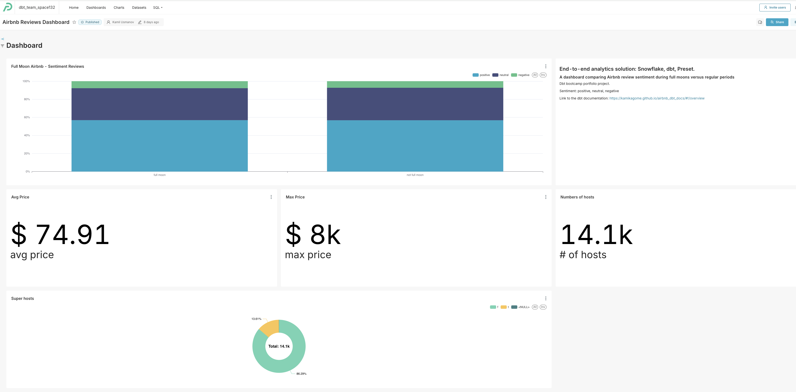
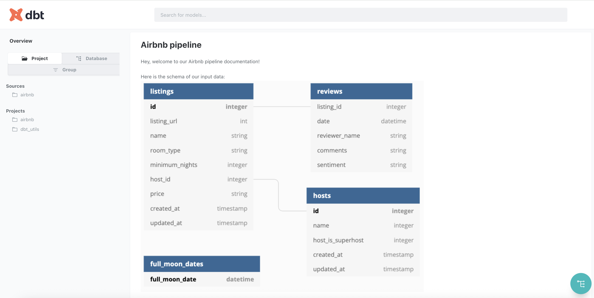

# Airbnb Analytics - dbt Project

A dbt practice project from the [Complete dbt Bootcamp](https://www.udemy.com/course/complete-dbt-data-build-tool-bootcamp-zero-to-hero-learn-dbt/) on Udemy, demonstrating data transformation and analytics engineering best practices.

## Overview

This project transforms raw Airbnb data into analytics-ready models using Snowflake and dbt. It features a fun hypothesis test: "Do people leave bad reviews more often during a full moon?"



**Stack:** Snowflake + dbt + Preset

## Project Structure

```
airbnb/
├── models/
│   ├── src/          # Source models (ephemeral)
│   ├── dim/          # Dimension tables
│   ├── fct/          # Fact tables
│   └── mart/         # Business marts
├── tests/            # Data quality tests
├── macros/           # Custom macros
├── snapshots/        # Historical tracking
└── seeds/            # Reference data
```

## Key Features

- **Medallion architecture** with source, dimension, fact, and mart layers
- **Custom tests and macros** for data quality
- **Snapshots** for historical data tracking (SCD Type 2)
- **Automated audit logging** with post-hooks
- **Preset dashboard (draft)** comparing review sentiment during full moon vs regular periods (+general overview)

## Quick Start

### 1. Install Dependencies

```bash
dbt deps
```

### 2. Configure Profile

Create `~/.dbt/profiles.yml`:

```yaml
airbnb:
  outputs:
    dev:
      type: snowflake
      account: YOUR_ACCOUNT
      user: YOUR_USERNAME
      # Add your credentials here
      database: AIRBNB
      schema: DEV
      warehouse: COMPUTE_WH
      threads: 4
  target: dev
```

> **Note**: Never commit `profiles.yml` - it contains credentials.

### 3. Run the Project

```bash
dbt run      # Build models
dbt test     # Run tests
dbt docs generate && dbt docs serve  # View documentation
```

## Documentation

It includes comprehensive dbt documentation with model lineage, column descriptions, and test coverage, deployed on GitHub Pages.



[📚 View Live Documentation](https://kamikagome.github.io/airbnb_dbt_docs/#!/overview)

## Resources

airbnb_dbt_docs/#!/overview) - Live documentation deployed on GitHub Pages
- [📊 Analytics Dashboard](https://6dc55a26.us2a.app.preset.io/superset/dashboard/8/?native_filters_key=w1MVW5D9SJDRyQQeJ4XlefWyFu4lW9MM7_DguUT4-N5A5RcL0mKw8Z39z05heQWL) - Interactive Preset dashboard
- [🎓 Course: Complete dbt Bootcamp](https://www.udemy.com/course/complete-dbt-data-build-tool-bootcamp-zero-to-hero-learn-dbt/)
- [dbt Documentation](https://docs.getdbt.com/docs/introduction)
